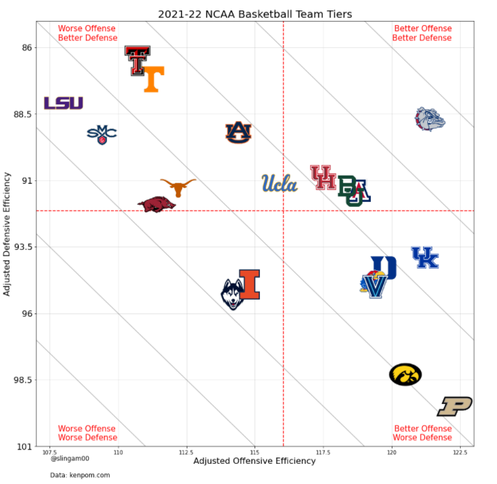

# NCAAMarchMadnessAnalysis

## Medium Article
A more in-depth analysis for this project can be found [here](https://medium.com/deep-dives-with-data/can-we-predict-the-winner-of-the-march-madness-tournament-de3ed0ea6c0d).

## Code
The code written for this project can be found in this Jupyter Notebook:
```MarchMadnessAnalysis.ipynb```

## Data
The data comes from [KenPom](https://kenpom.com/) which was developed by Ken Pomeroy—a college basketball statistician and columnist. I used [kenpompy](https://github.com/j-andrews7/kenpompy) which is a Python web scraper for the website. In order to use kenpompy, I had to subscribe to Ken Pomeroy's site for a small fee to access all of the different tables.

## NCAA Basketball Team Tier Plot
The team tier plot is a four quadrant plot that represents how good a team with respect to the other top teams using the KenPom ratings using school logos. Here is the result of the plot:



The Gonzaga Bulldogs have been the best regular season team this season and have been in a tier of their own with their stellar offense and defense.
